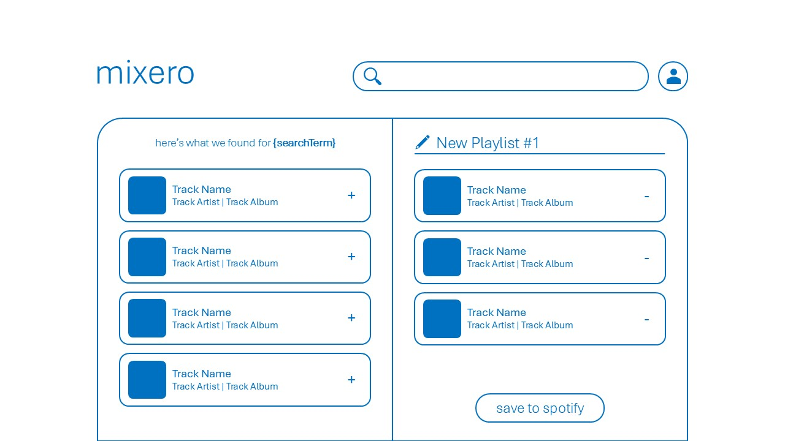

# Mixero

A modern Spotify playlist manager built with React. Create, organize, and export playlists with ease. No adds and free forever, powered by Spotify.

## Overview

Mixero helps you create and manage playlists on Spotify with a clean, distraction-free interface. Focus on curating your perfect playlist while we handle the complexity of playlist management.

## Features

- **Extensive Music Library**: Search and access Spotify's catalog of over 100 million tracks
- **Advanced Search**: Real-time results with intelligent suggestions
- **Playlist Management**: Create, edit, and organize playlists seamlessly
- **Offline Capability**: Continue creating playlists without internet connection
- **Spotify Integration**: Export playlists directly to your Spotify account
- **Dark Mode Support**: Optimized viewing experience in any environment

## Images




## Technical Stack

- React
- Vite
- Redux Toolkit
- Spotify Web API
- Node.js

## Prerequisites

- Node.js (version 18 or higher)
- Spotify Developer Account

## Installation

1. **Clone Repository**
   ```bash
   git clone https://github.com/your-username/mixero.git
   cd mixero
   ```

2. **Install Dependencies**
   ```bash
   npm install
   ```

3. **Configure Environment**
   Create `.env` in project root:
   ```env
   # Required Configuration
   VITE_SPOTIFY_CLIENT_ID=your_spotify_client_id
   VITE_SPOTIFY_REDIRECT_URI=http://localhost:5173/callback

   # Optional Configuration
   VITE_SPOTIFY_API_ENDPOINT=https://api.spotify.com/v1/
   VITE_SPOTIFY_AUTH_ENDPOINT=https://accounts.spotify.com/authorize
   VITE_SPOTIFY_TOKEN_ENDPOINT=https://accounts.spotify.com/api/token
   VITE_SPOTIFY_AUTH_SCOPE=user-read-private user-read-email playlist-modify-private playlist-modify-public
   ```

4. **Development**
   ```bash
   # Start development server
   npm run dev

   # Build for production
   npm run build

   # Preview production build
   npm run preview
   ```

## Configuration

1. **Spotify Developer Setup**
   - Create an application in the [Spotify Developer Dashboard](https://developer.spotify.com/dashboard)
   - Add `http://localhost:5173` to the Redirect URIs
   - Copy the Client ID to your `.env` file

## Usage Instructions

1. **Authentication**
   - Select "Connect with Spotify"
   - Authorize the application permissions

2. **Playlist Creation**
   - Create a new playlist
   - Use the search functionality to find tracks
   - Add tracks via click or drag-and-drop
   - Organize tracks through drag-and-drop reordering

3. **Spotify Export**
   - Set playlist name and description
   - Select "Save to Spotify"
   - Access the playlist in your Spotify library

## Troubleshooting Guide

### Authentication Issues
- Verify Client ID configuration
- Confirm redirect URI matches Spotify application settings
- Clear browser session data if necessary

### Search Functionality
- Verify network connectivity
- Check Spotify API status
- Reauthorize application if session has expired

## Contributing Guidelines

1. Fork the repository
2. Create a feature branch: `git checkout -b feature/enhancement`
3. Commit changes: `git commit -m 'Add enhancement'`
4. Push to branch: `git push origin feature/enhancement`
5. Submit a Pull Request

## License

This project is licensed under the MIT License - see the [LICENSE](LICENSE) file for details.

---

My first ever app ❤️